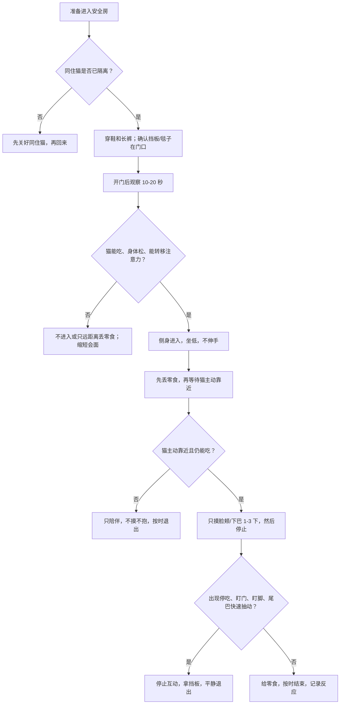

# 示例 Consult：窗外猫触发后的转嫁攻击康复方案

这是一个虚构示例，用来展示 skill 的输出深度。它不是针对真实动物的兽医建议。

## 已确认 Case Summary

- 4 岁、已绝育、室内猫。
- 触发点高度一致：客厅窗边看到户外猫后，约 20 秒内攻击照护者小腿。
- 本月已发生 2 次；一次咬伤破皮。
- 同住猫目前已经隔开。
- 家里没有儿童；最近没有做过兽医检查。
- 攻击后约 40 分钟才恢复，说明高唤醒状态持续时间不短。

## 核心判断

最可能是 **redirected aggression**：猫被窗外猫高度唤醒，但无法接触真正触发源，于是把攻击转向最近、最容易接触到的照护者。疼痛、皮肤病、泌尿问题、牙痛、神经问题和内分泌问题仍然要排除，因为医学不适会降低攻击阈值。

照护者可以继续参与康复，但只在安全场景里参与。目标不是“安抚发作中的猫”，而是让猫重新把照护者、安全房、固定流程和好结果联系起来。

## 今天开始

1. 猫暂住独立安全房，门要可靠，防止自己打开。
2. 同住猫和她不见面、不同框、不隔门互相盯。
3. 安全房保留猫砂、水、食物、窝、藏身处、抓挠点、垂直空间和信息素。
4. 客厅触发窗暂时遮挡低处视线；户外猫活跃时关闭该区域。
5. 照护者每天固定 2 到 3 次查看，每次 5 到 10 分钟。状态好也按时结束。
6. 进门前穿鞋、长裤；门口放厚毯子和挡板。
7. 咬伤破皮的人需要按当地医疗建议处理伤口，并留意感染风险。

## 执行流程图

## 照护者进入安全房流程

| 步骤 | 做法 | 停止条件 |
| --- | --- | --- |
| 进门前 | 确认同住猫不在门口；穿鞋、长裤；挡板和毯子在手边。 | 同住猫在附近、门口拥挤、照护者无法安全退出。 |
| 开门后 | 观察 10 到 20 秒。看猫是否能吃、身体是否放松、是否盯门/盯脚。 | 停吃、盯门、盯脚、低吼、hiss、炸毛。 |
| 进入后 | 侧身、坐低、低声；先丢零食，不主动伸手。 | 猫靠近但身体变硬、尾巴快速抽动。 |
| 短接触 | 只有猫主动靠近、能吃、能转移注意力时，摸脸颊/下巴 1 到 3 下。 | 猫停吃、转头盯门/脚、突然僵住。 |
| 结束 | 状态好也按时结束，给零食后平静离开。 | 不为了“多陪一会儿”延长 session。 |

## 接触判断表

| 风险 | 你会看到什么 | 怎么做 |
| --- | --- | --- |
| 低风险 | 主动靠近、身体松、能吃、不盯门、不盯脚。 | 可以短接触：摸 1 到 3 下就停。 |
| 中风险 | 靠近但身体硬；吃零食变慢；尾巴开始抽动；门口有声音。 | 只丢零食和陪伴。不摸、不抱，准备退出。 |
| 高风险 | 低吼、hiss、炸毛、瞳孔大、来回巡视、盯脚、盯门。 | 退出，关门。不要徒手处理。 |
| 危险 | 扑、咬、抱手、后腿踢、攻击挡板或物品。 | 用毯子遮挡视线，隔开距离，关门，必要时联系兽医/行为专科。 |

## 同住猫处理

1. 暂时物理分开，不隔门互相盯。
2. 每天做低强度气味交换：软布、睡垫、脸颊气味；先不用猫砂盆气味。
3. 闻到气味后还能吃、能放松，才继续。
4. 低吼、hiss、盯门、攻击布片，就减量或暂停。
5. 重新见面按步骤来：隔门安静共存 → 隔栅远距离 → 短时视觉接触 → 短时同处。任何紧张都退回上一步。

## 阶段计划

| 阶段 | 目标 | 通过标准 |
| --- | --- | --- |
| 第 1 阶段：稳定 | 安全房、固定作息、遮挡窗边触发、同住猫分开。 | 连续数天无攻击、能吃、能休息。 |
| 第 2 阶段：安全连接 | 照护者短时进入，零食和低强度陪伴。 | 猫主动靠近，仍能吃，能离开互动。 |
| 第 3 阶段：气味联系 | 与同住猫低强度气味交换。 | 闻气味后无低吼、hiss、盯门或攻击布片。 |
| 第 4 阶段：触发脱敏 | 极低强度处理脚步、开门声、窗边线索。 | 训练中能吃、身体松、可转移注意力。 |
| 第 5 阶段：重引入 | 同住猫从隔门到隔栅再到短时同处。 | 两只猫能短时放松共处，无追逐、低吼或僵持。 |

## 行动-证据对照表

| 行动 | 安全目的 | 科学依据 | 公开实践对照 | 停止 / 升级条件 |
| --- | --- | --- | --- | --- |
| 遮挡触发窗、减少户外猫刺激 | 阻断 redirected aggression 的上游触发。 | Amat et al. 2019, PMID:30798644；Frank & Dehasse 2003, PMID:12701512。 | Cornell Feline Health Center 和 VCA 都把窗外猫列为常见 redirected aggression 触发，并建议移除/遮挡刺激。Vetstreet 也建议用窗膜遮挡低处视线。 | 仍持续扑窗、攻击人或攻击同住猫。 |
| 安全房 + 短时固定探视 | 降低刺激密度，让猫恢复可预测感。 | Amat et al. 2016, PMID:26101238；Stelow 2018, PMID:29429600。 | VCA redirected aggression 资料建议在安全区域等待猫冷静后再释放。 | 安全房内仍高唤醒、停吃、无法休息。 |
| 不徒手安抚发作中的猫 | 避免照护者成为最近攻击目标。 | Frank & Dehasse 2003, PMID:12701512。 | Cornell 和 VCA 都描述 redirected aggression 会攻击附近人或同住动物。 | 出现破皮伤、扑咬升级、无法安全退出。 |
| 只在“主动、能吃、能转移注意力”时短接触 | 把互动控制在低阈值内。 | Amat et al. 2016, PMID:26101238；Stelow 2018, PMID:29429600。 | Petful 的公开案例把食物和正向 reconditioning 作为实践模式，但只能视为 anecdotal。 | 停吃、盯门、盯脚、身体僵硬。 |
| 同住猫先做气味联系，再重引入 | 防止猫间关系被一次高唤醒事件固定成冲突。 | Amat et al. 2019, PMID:30798644；Stelow 2018, PMID:29429600。 | VCA 和 Vetstreet 都建议避免再次暴露触发，并在关系受影响时逐步处理。 | 隔门盯视、低吼、hiss、攻击布片或门缝。 |

## 真实案例 / 公开实践来源

- Cornell Feline Health Center: [Feline Behavior Problems: Aggression](https://www.vet.cornell.edu/departments-centers-and-institutes/cornell-feline-health-center/health-information/feline-health-topics/feline-behavior-problems-aggression)
- VCA Animal Hospitals: [Cat Behavior Problems: Aggression Redirected](https://vcahospitals.com/know-your-pet/cat-behavior-problems-aggression-redirected)
- Vetstreet: [My Indoor Cat Is Being Tormented by an Outdoor Cat](https://www.vetstreet.com/our-pet-experts/help-my-indoor-cat-is-being-tormented-by-an-outdoor-cat)
- Petful: [Redirected Aggression in Cats](https://www.petful.com/behaviors/redirected-aggression-in-cats/)

这些来源支持“遮挡/移除触发、等待冷静、避免徒手介入、逐步重引入”的实践方向。它们不是替代论文的疗效证据；在 consult 中应和科学文献分开呈现。
